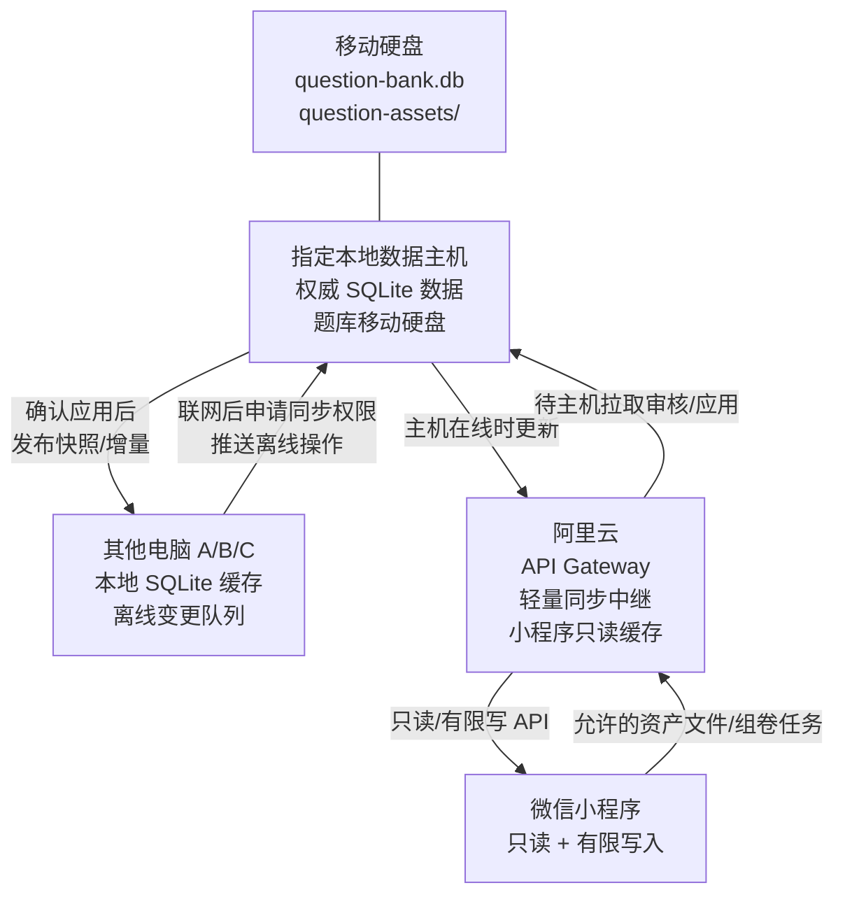

# 格物工坊多端本地优先数据架构改造任务书

创建日期：2026-06-25  
当前目标：把格物工坊从“单机/半云同步”升级为“指定本地主机为权威数据中心 + 多电脑离线可写 + 移动硬盘题库独立存储 + 阿里云只做中继/小程序服务 + 微信小程序有限写入”的多端系统。

---

## 1. 需求解读

你的核心诉求不是简单“云同步”，而是一个本地优先、低服务器成本、可离线工作的私有数据系统：

1. **只有一台指定电脑存储全量权威数据**
   - 这台电脑是“本地数据主机”。
   - 它长期联网，但允许偶尔断网。
   - 它可以更改所有数据，并负责保存最终权威版本。

2. **题库数据要独立存储在移动硬盘**
   - 题库通常体积最大，尤其包含图片、Word 导入资源、组卷导出材料。
   - 题库数据库和题库附件应从普通业务数据库里拆出来。
   - 移动硬盘未连接时，题库模块必须给出明确提示，不能静默写入错误位置。

3. **其他电脑也安装桌面端，并拥有全部权限**
   - 所有电脑端默认都是全功能桌面管理端。
   - 非主机电脑可以断网使用。
   - 断网期间对教务、题库、财务等所有数据的修改先保存在本机。
   - 联网后先提示用户“是否获取同步权限/开始同步”，获得确认后再推送到本地数据主机。
   - 同步成功后，本地数据主机再更新阿里云服务器上的数据。

4. **阿里云服务器和微信小程序也要部署**
   - 阿里云不应成为最重的数据存储中心，否则服务器成本会升高。
   - 阿里云更适合作为：
     - 微信小程序 API 入口；
     - 本地主机断网时的只读缓存；
     - 同步状态、设备注册、授权令牌、中继队列；
     - 必要的轻量索引和最近快照。

5. **微信小程序权限受限**
   - 小程序大部分功能只读。
   - 允许写入/生成的范围：
     - 导入财务模块个人资产统计所需的数据文件；
     - 题库试题选择；
     - 组卷；
     - 导出 Word 和 PDF。
   - 不允许小程序随意修改教务、题库基础数据、课程、学生、收支等核心数据。

6. **执行顺序**
   - 先完成底层架构；
   - 再逐步和你确认微信小程序 UI；
   - 最后由 Codex 协助部署阿里云和微信小程序。

---

## 2. 推荐总体架构

推荐采用“本地主机权威 + 云端中继/缓存 + 客户端本地队列”的方案。



### 2.1 数据权威关系

| 数据类型 | 权威位置 | 云端角色 | 其他电脑角色 | 小程序角色 |
|---|---|---|---|---|
| 教务：学生/课程/排课/收费/消耗 | 本地数据主机 | 缓存/只读 API/中继 | 离线可写，联网后同步 | 只读 |
| 财务：个人资产统计 | 本地数据主机 | 缓存/导入任务中继 | 离线可写，联网后同步 | 可导入指定数据文件 |
| 题库元数据：题目/知识点/模型/标签 | 本地数据主机 + 移动硬盘题库 DB | 缓存/搜索索引/组卷 API | 离线可写，联网后同步 | 选题/组卷，不直接改题库基础数据 |
| 题库附件：图片/导入文件/导出文件 | 移动硬盘 | 可选缓存或临时下载 | 本地缓存/同步摘要 | 导出 Word/PDF 文件 |
| 权限/设备/同步授权 | 本地数据主机 + 云端轻量副本 | 登录、设备注册、授权中继 | 申请同步权限 | 登录/权限判断 |

---

## 3. 当前项目现状

当前代码库已经具备部分基础：

1. **桌面端**
   - React + Electron。
   - `public/electron.js` 会启动内嵌 `backend`。
   - 默认数据路径目前在 Electron `userData/data/scheduling.db`。

2. **后端**
   - `backend/src/database.js` 使用 `better-sqlite3`。
   - `backend/src/routes/sync.js` 已有 `/api/sync/pull`、`/api/sync/push`、`/api/sync/status`。
   - 数据表已有 `tenant_id`、`updated_at`、`deleted`、`sync_log`、`sync_audit_log`、`outbox_events` 等同步相关基础。

3. **前端同步**
   - `src/services/syncEngine.ts` 已有本地 pending changes、push/pull、冲突雏形。
   - `miniapp/src/utils/syncEngine.ts` 也有小程序侧同步雏形。

4. **题库**
   - 题库页面和导入/组卷/预览功能已经在桌面端。
   - 题库图片目前有 `IndexedDB` 存储辅助：`src/services/questionAssetStore.ts`。
   - 后端 schema 已包含题库相关表和附件表。

5. **小程序**
   - 已存在 `miniapp/`，包含 Taro 页面：课程、学生、老师、支付、资产、排课等。
   - 需要按新权限模型收缩写能力。

结论：不需要从零重写，但当前同步模型还不够满足“本地主机权威 + 多电脑离线写 + 移动硬盘题库 + 云端中继”的强约束，需要先做数据架构收敛。

---

## 4. 关键设计决策

### 4.1 角色定义

新增运行模式：

1. `primary-host`
   - 指定本地数据主机。
   - 持有权威业务数据库。
   - 持有或连接题库移动硬盘。
   - 对其他电脑开放局域网/公网可达的同步服务。
   - 负责向阿里云发布最新已确认数据。

2. `desktop-client`
   - 其他电脑。
   - 本地有完整缓存和离线操作队列。
   - 可读写所有模块。
   - 联网后必须经用户确认才推送离线变更。

3. `cloud-relay`
   - 阿里云服务。
   - 不作为最终权威写库。
   - 保存轻量同步中继、只读快照、小程序任务。

4. `miniapp`
   - 微信小程序。
   - 默认只读。
   - 只允许提交财务导入文件、题库选题/组卷/导出任务。

### 4.2 同步协议

采用“操作日志 + 快照版本 + 冲突审核”的同步模型：

1. 每台设备都有稳定 `device_id`。
2. 每次本地修改写入：
   - 本地业务表；
   - 本地 `change_queue`/pending changes；
   - 操作包含 `operation_id`、`device_id`、`table`、`record_id`、`action`、`base_version`、`new_version`、`payload`、`created_at`。
3. 非主机电脑联网后：
   - 检测本地主机或云端中继可达；
   - 弹出同步提示；
   - 用户确认后请求短期同步授权；
   - 推送 pending changes。
4. 主机收到变更后：
   - 先校验权限和 schema；
   - 检查 `base_version` 是否仍匹配；
   - 无冲突则应用；
   - 有冲突则进入冲突列表，等待用户选择“本机优先/主机优先/字段合并”。
5. 主机应用成功后：
   - 写入权威数据库；
   - 写入审计日志；
   - 生成新的增量队列；
   - 推送/发布到阿里云。

### 4.3 冲突原则

默认策略：

1. 不静默覆盖。
2. 不用简单“最后写入获胜”处理所有业务数据。
3. 对低风险字段可自动合并：
   - 备注、标签追加、最后访问时间。
4. 对高风险字段必须人工确认：
   - 学生余额、课消、付款、课程时间、题目正文、答案、解析、资产流水。

### 4.4 移动硬盘题库

题库独立存储结构建议：

```text
<移动硬盘>/GewuQuestionBank/
  question-bank.db
  assets/
    images/
    word-imports/
    exports/
  backups/
  manifest.json
  lock.json
```

`manifest.json` 记录：

```json
{
  "storeId": "qb_xxx",
  "createdAt": "2026-06-25T00:00:00.000Z",
  "schemaVersion": 1,
  "lastMountedByDeviceId": "desktop_xxx",
  "lastVerifiedAt": "2026-06-25T00:00:00.000Z"
}
```

必须实现：

1. 设置页面选择题库移动硬盘路径。
2. 启动时检测路径是否可用。
3. 路径不可用时：
   - 题库只读或禁用；
   - 禁止导入/编辑/组卷导出到缺失目录；
   - 给出“连接移动硬盘后重试”的明确提示。
4. 题库附件从 IndexedDB 逐步迁移到移动硬盘文件系统。

### 4.5 阿里云角色

阿里云部署建议保留现有 Node/Express/Gateway 方向，增强为：

1. 设备注册与认证。
2. 小程序登录与权限。
3. 主机心跳状态。
4. 只读快照 API。
5. 小程序允许的写入任务：
   - 财务导入任务；
   - 组卷任务；
   - 导出 Word/PDF 任务。
6. 同步中继队列：
   - 当主机在线时，云端把任务推给主机；
   - 当主机离线时，云端保留任务并提示数据可能不是最新。

---

## 5. 执行阶段

### 阶段 0：设计确认与安全边界

目标：确认架构取舍，避免后续大规模返工。

任务：

- [ ] 确认是否采用“本地主机权威 + 云端中继/缓存”模式。
- [ ] 确认其他电脑是否允许在未同步前长期离线累计修改。
- [ ] 确认冲突处理是否采用“高风险数据人工确认”。
- [ ] 确认移动硬盘题库目录结构。
- [ ] 确认阿里云是否只保留轻量缓存，而不是完整长期权威库。

验收：

- [ ] 你确认本文件中的底层架构方向。
- [ ] 生成正式设计文档：`docs/superpowers/specs/2026-06-25-local-first-sync-design.md`。
- [ ] 生成正式实施计划：`docs/superpowers/plans/2026-06-25-local-first-sync.md`。

### 阶段 1：运行模式与数据路径配置

目标：让软件知道自己是主机还是普通客户端，并支持配置权威库/题库盘路径。

任务：

- [ ] 新增本机配置文件，例如 `gewugongfang.config.json`。
- [ ] 新增字段：
  - `nodeRole`: `primary-host | desktop-client`
  - `deviceId`
  - `hostBaseUrl`
  - `cloudBaseUrl`
  - `mainDbPath`
  - `questionBankPath`
  - `questionAssetPath`
- [ ] Electron 启动内嵌后端时注入这些路径。
- [ ] 设置页新增“数据存储与同步角色”配置。

验收：

- [ ] 主机模式能指定 `scheduling.db` 路径。
- [ ] 客户端模式能指定本地缓存库路径。
- [ ] 题库路径缺失时 UI 有明确警告。
- [ ] 配置修改后重启生效。

### 阶段 2：题库移动硬盘存储层

目标：把题库大数据从普通本地存储中拆出来。

任务：

- [ ] 建立 `QuestionBankStorageService`。
- [ ] 支持初始化移动硬盘目录。
- [ ] 支持读取/写入 `manifest.json`。
- [ ] 支持文件锁或写入锁，避免两台电脑同时直接写移动硬盘。
- [ ] 将题库附件存储从 IndexedDB 迁移为文件系统优先。
- [ ] 保留 IndexedDB 作为临时缓存/兼容层。

验收：

- [ ] 移动硬盘未连接时题库不能误写入默认目录。
- [ ] 题库图片/Word 导入附件可落盘。
- [ ] 组卷导出的 Word/PDF 可保存到题库导出目录。
- [ ] 旧数据可迁移或兼容读取。

### 阶段 3：统一变更捕获层

目标：所有模块的数据修改都进入统一操作队列，而不是散落在各页面里。

任务：

- [ ] 建立 `DataMutationService`。
- [ ] 每次 create/update/delete 统一记录 operation。
- [ ] 覆盖表：
  - students
  - teachers
  - courses
  - schedules
  - payments
  - consumptions
  - institutions
  - rooms
  - schools
  - assetRecords
  - assetCategories
  - questions
  - question assets metadata
  - tags/knowledge/model trees
- [ ] 前端页面逐步改为调用统一服务。

验收：

- [ ] 断网状态修改任一模块都会产生 pending operation。
- [ ] 操作队列可查看、可重试、可清空（清空需要二次确认）。
- [ ] 测试覆盖至少 5 类高风险业务数据。

### 阶段 4：本地主机同步服务

目标：主机电脑成为其他电脑的同步接收方。

任务：

- [ ] 后端新增主机发现/连接状态 API。
- [ ] 后端新增同步授权 API。
- [ ] 后端增强 `/api/sync/push`：
  - 设备校验；
  - 授权 token；
  - base_version 校验；
  - 冲突返回；
  - 审计日志。
- [ ] 后端增强 `/api/sync/pull`：
  - 按设备增量返回；
  - 排除设备自己已确认的操作；
  - 支持快照初始化。
- [ ] 主机同步控制台显示：
  - 在线设备；
  - 待审批推送；
  - 冲突列表；
  - 最近同步日志。

验收：

- [ ] 客户端联网后能发现主机。
- [ ] 用户确认后才能推送。
- [ ] 主机可应用无冲突操作。
- [ ] 主机可阻止冲突操作并展示原因。

### 阶段 5：客户端离线同步体验

目标：其他电脑断网也能完整使用，联网后安全同步。

任务：

- [ ] 统一离线状态检测。
- [ ] 首页/同步页显示：
  - 当前是否离线；
  - 待同步数量；
  - 最后同步时间；
  - 是否有冲突。
- [ ] 联网后弹出提示：
  - “检测到 X 条离线更改，是否申请同步到主机？”
- [ ] 同步前拉取主机最新变更，先做冲突预检。
- [ ] 支持手动同步、稍后提醒、只拉取不推送。

验收：

- [ ] 客户端断网新增/修改数据不丢。
- [ ] 恢复网络后不会自动静默覆盖主机。
- [ ] 用户确认后才推送。
- [ ] 同步失败后 pending queue 仍保留。

### 阶段 6：阿里云中继与小程序只读缓存

目标：云端服务小程序，并作为主机与小程序之间的轻量桥梁。

任务：

- [ ] 设计云端数据库，只保存：
  - 设备；
  - 用户；
  - 权限；
  - 主机心跳；
  - 只读快照；
  - 小程序任务队列；
  - 同步中继元数据。
- [ ] 主机定时向云端发布只读快照。
- [ ] 云端 API 区分：
  - `read-only`；
  - `miniapp-write-task`；
  - `host-sync`。
- [ ] 云端不直接接受小程序对核心业务表的修改。

验收：

- [ ] 小程序可读教务/题库/资产统计快照。
- [ ] 主机离线时小程序能提示“数据截至某时间”。
- [ ] 小程序提交的允许写任务进入待处理队列。

### 阶段 7：微信小程序功能权限收敛

目标：小程序符合“多数只读，少量允许写”的规则。

任务：

- [ ] 重构小程序权限表。
- [ ] 教务模块只读。
- [ ] 财务个人资产支持导入文件任务。
- [ ] 题库支持：
  - 搜索/筛选试题；
  - 选择题目；
  - 组卷；
  - 导出 Word；
  - 导出 PDF。
- [ ] 其他写操作隐藏或禁用，并给出说明。

验收：

- [ ] 小程序无法修改学生/课程/排课/付款/题库原题。
- [ ] 小程序可完成一次选题组卷。
- [ ] 小程序可下载或打开导出的 Word/PDF。

### 阶段 8：微信小程序 UI 逐步确认

目标：底层功能稳定后，再做界面，不让 UI 设计拖住架构。

执行方式：

- [ ] 先与你确认首页信息架构。
- [ ] 再确认题库选题流程。
- [ ] 再确认组卷与导出流程。
- [ ] 再确认财务文件导入流程。
- [ ] 每个流程给 2-3 个 UI 方向，选择后实现。

验收：

- [ ] 小程序首页清楚表达只读/可操作入口。
- [ ] 题库组卷路径短、按钮明确。
- [ ] 导出状态可追踪。

### 阶段 9：部署阿里云和微信小程序

目标：完成真实可用部署。

任务：

- [ ] 检查阿里云服务器环境。
- [ ] 配置 Node 服务、PM2、Nginx、HTTPS。
- [ ] 配置云端环境变量。
- [ ] 部署 gateway/backend。
- [ ] 验证主机到云端心跳。
- [ ] 配置微信小程序合法域名。
- [ ] 构建并上传小程序。
- [ ] 进行线上 smoke test。

验收：

- [ ] 云端健康检查通过。
- [ ] 小程序能登录/访问只读数据。
- [ ] 主机能发布快照。
- [ ] 小程序组卷/导出任务能被主机处理。

---

## 6. 测试策略

必须优先覆盖这些场景：

1. 主机在线，客户端在线，同步成功。
2. 主机离线，客户端继续本地修改。
3. 客户端离线修改后恢复联网，用户确认后同步。
4. 主机和客户端修改同一条付款/课消记录，触发冲突。
5. 移动硬盘未连接时打开题库。
6. 移动硬盘连接后导入 Word 题库。
7. 小程序尝试修改只读数据，被拒绝。
8. 小程序提交组卷任务，主机处理并返回 Word/PDF。

---

## 7. 风险与规避

| 风险 | 影响 | 规避 |
|---|---|---|
| 多电脑离线同时改同一条数据 | 数据覆盖或金额错误 | base_version + 冲突审核 |
| 移动硬盘盘符变化 | 题库路径失效 | 用 manifest/storeId 校验，不只依赖盘符 |
| 主机长期离线 | 小程序数据滞后 | 云端显示快照时间，限制写任务状态 |
| 题库附件体积过大 | 同步慢、云成本高 | 附件本地硬盘权威，云端只缓存必要导出 |
| 当前代码部分数据仍在 localStorage | 同步漏数据 | 阶段 3 统一变更捕获，逐步迁移 |
| 小程序权限边界不清 | 误写核心数据 | API 层强制只读，不只靠 UI 隐藏 |

---

## 8. 当前最需要你确认的问题

为了开始写正式设计文档和实施计划，需要你确认下面 5 个关键点：

1. 是否确认采用“本地主机权威，阿里云只做中继/缓存/小程序 API”的模式？
2. 其他电脑是否允许离线好几天后再同步？如果允许，冲突会更多，但体验更自由。
3. 高风险数据冲突是否必须人工确认？尤其是付款、课消、资产流水、题目正文/答案。
4. 题库移动硬盘是否只允许主机直接写入，其他电脑通过同步写入主机？这是我推荐的安全方案。
5. 阿里云是否允许保存一份只读题库文本快照用于小程序搜索？附件和原始 Word/PDF 仍放本地/按需导出。

---

## 9. 下一步

如果你确认以上方向，我将继续：

1. 写正式设计文档：
   - `docs/superpowers/specs/2026-06-25-local-first-sync-design.md`
2. 写正式实施计划：
   - `docs/superpowers/plans/2026-06-25-local-first-sync.md`
3. 从阶段 1 开始执行：
   - 运行模式配置；
   - 数据路径配置；
   - 题库移动硬盘检测；
   - 同步授权与队列。

